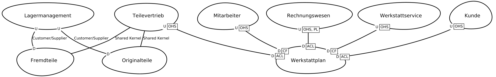

[[section-system-scope-and-context]]

= Kontextabgrenzung

Der Umfang und Kontext des Systems (engl. System Scope and Context)  grenzt ein System ab. Diese Abgrenzung bezieht sich auf die Kommunikationspartner des Systems, d.h. Nachbarsysteme und Benutzer. Der Scope legt damit die externen Schnittstellen fest.

Der Kontext wird hier differenziert in den geschäftlichen Kontext (domänenspezifische Ein- und Ausgänge) und den  technischen Kontext (Kanäle, Protokolle, Hardware).

== Fachlicher Kontext

Motivation: Die Domänenschnittstellen und die technischen Schnittstellen zu den Kommunikationspartnern gehören laut arc42 zu den kritischsten Aspekten eines Systems. Diese sind möglichst vollständig aufzuarbeiten.

In der Form eignen sich hierfür verschiedene Kontextdiagramme, sowie Listen von Kommunikationspartnern und deren Schnittstellen.

-> Systemkontextdiagram (evtl. via SysML) hier einfügen, um den fachlichen Kontext zu illustrieren.

== Technischer oder Verteilungskontext

Im Vordergrund dieses Abschnittes stehen die technischen Schnittstellen (Kanäle und Übertragungsmedien), die das dqualizer System mit seiner Umgebung verbinden.

Zudem wird in arc42 ein Mapping der bereichsspezifischen Ein-/Ausgabe zu den Kanälen empfohlen (d. h. eine Angabe, welche Ein-/Ausgabe welche Kanäle verwendet).

Examples:

Example via https://docs.arc42.org/examples/technical-context-1/#32-technical-context.

The following diagram shows e.g. the participating computers (nodes) with their technical connections plus the major artifacts etc.

MES-Beispiel (System-) Kontextabgrenzung:

Das Miroboard enthält eine Abbildung bezüglich der Systemkontextsicht. Diese evtl. hier mittels PlantUML einfügen.

Das folgende Diagramm zeigt das Softwaresystem Werkstatt und seinen Systemkontext bestehend aus den Nutzern des Softwaresystems, der eigenen Datenbank und Nachbarsysteme names Mitarbeiter und Originalteile.

[plantuml,target=system-context,format=png]
....

actor "Werkstattmeister:in" as meister
actor "Serviceberater:in" as berater
actor "Werkstattmitarbeiter:in" as mitarbeiter

component Werkstatt <<subdomain>>

node Mitarbeiter <<bounded context>>
node Orignalteile <<boundded context>>

database WerkstattDB

Werkstatt --> WerkstattDB
Werkstatt --> Mitarbeiter

meister --> Werkstatt
berater --> Werkstatt
mitarbeiter --> Werkstatt
Orignalteile -- Werkstatt

....

Context Map Beispiel:

Die Context Map zeigt die Bounded Contexts des Autohauses und gibt einen Überblick über die gesamte Domäne Autohaus und setzt die Subdomäne Werkstatt mit den Bounded Contexts Werkstattplanung und Werkstattservice in das sozio-technische Gesamtbild.

